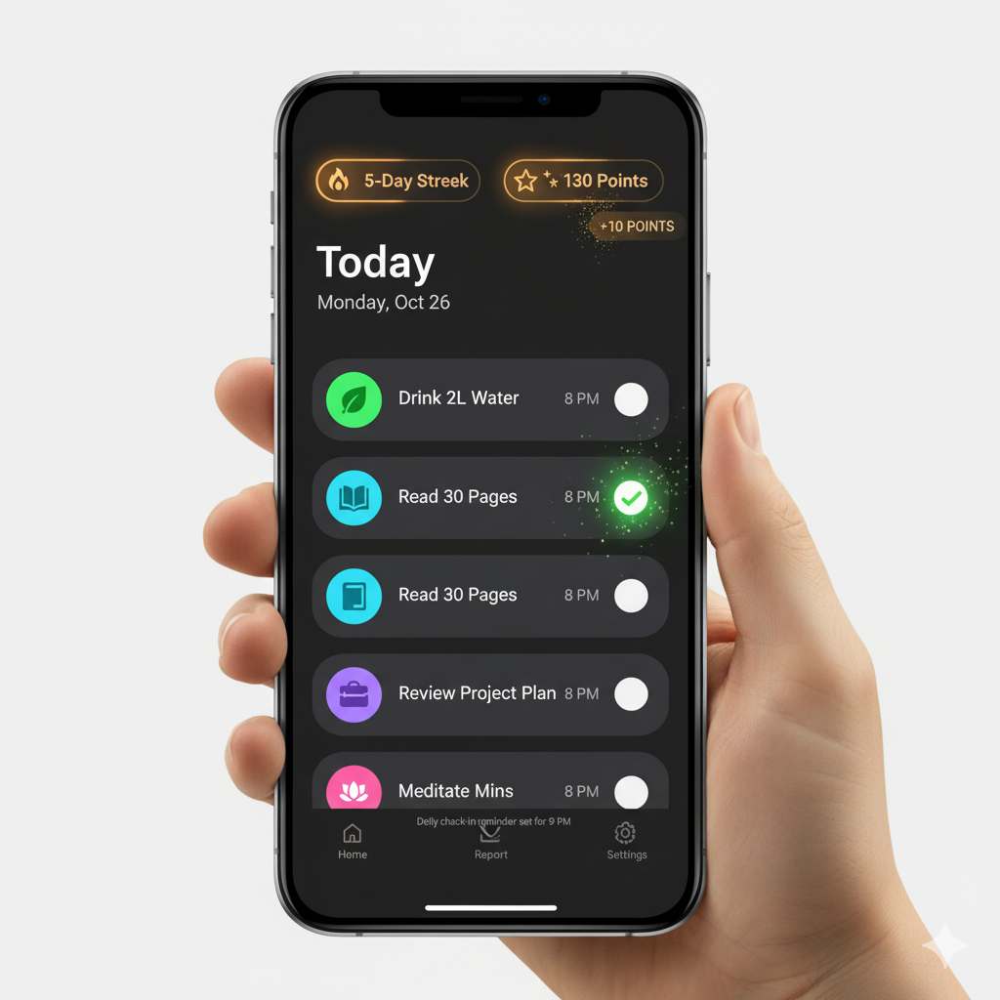
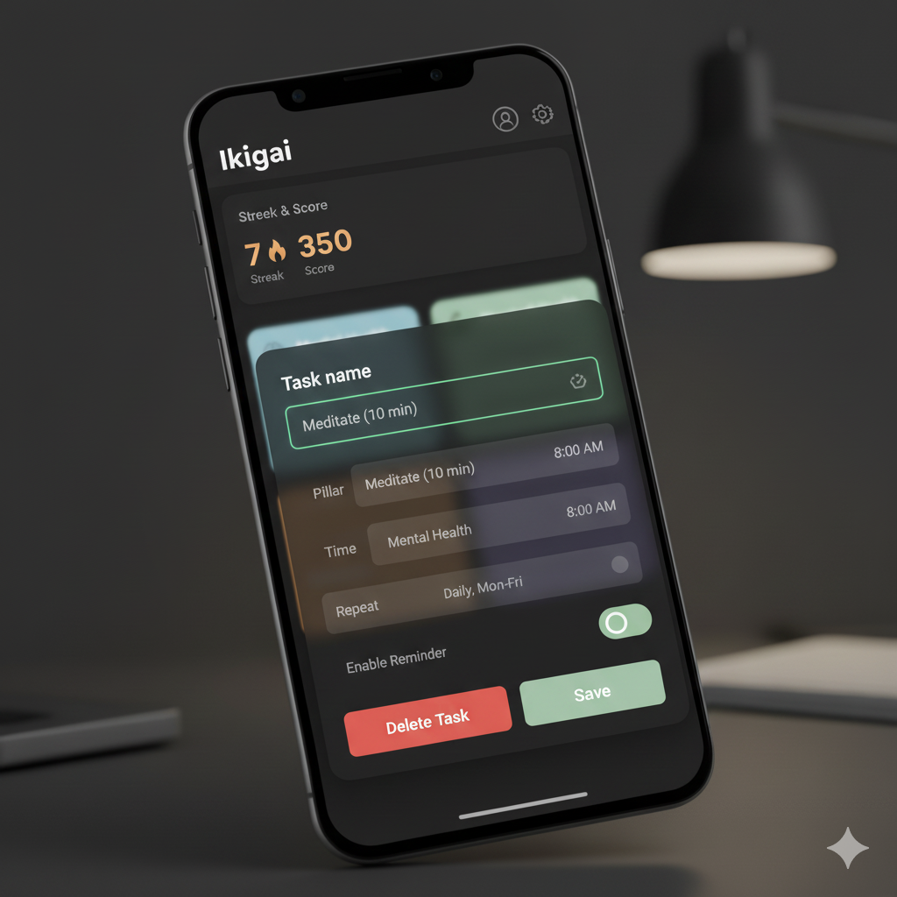
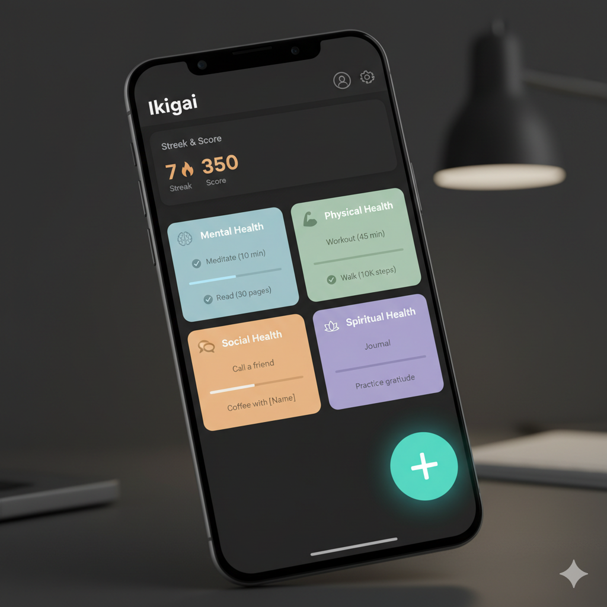

# Project Summary: The "Ikigai" App

## 1. App Name & Core Idea
- **App Name**: Ikigai
- **Core Idea**: Minimalist habit tracker that helps users improve their lives holistically using a balanced framework.
- **Problem Solved**: Goes beyond a simple to‑do list by structuring habits around whole‑life improvement.

## 2. The Four Pillars of Well‑being
- **Mental Health**: Meditation, reading, journaling, learning a new skill
- **Physical Health**: Exercise, nutrition, sleep, hydration
- **Social & Family**: Calling a friend, family time, gratitude
- **Intellectual & Purpose**: Volunteering, creative hobbies, time in nature

## 3. Main Features & Modules
### Core Loop
- Users add and manage tasks
- Mark tasks complete to earn points and maintain a streak
- Subtle animation on completion for satisfying feedback

### Task Management
- **Quick Add**: Pop‑up/bottom sheet with prefilled fields: task name, reminder time, repeat frequency, pillar + icon
- **Gamification**: Scores, milestones, streaks with instant feedback
- **Categorization**: Assign tasks to one of the four pillars
- **Reminders**:
  - App‑level: daily check‑in reminder
  - Task‑level: per‑task reminders in detailed edit view (optional)
- **Report Page**: Long‑term progress: focused category, least focused, tasks completed/total, score, level, streak

## 4. Material Design Philosophy (Dark Theme)
- Dark background around `#121212` with lighter surfaces for elevation
- Subtle elevation and shadows; lighter elevated surfaces
- Bold, intentional typography (Roboto or similar)
- Meaningful motion for feedback (ripple, fade‑in, completion micro‑animation)

## 5. Page‑by‑Page Implementation
### 5.1 Main Dashboard
- Organized, clean, immediately informative
- Streak & score as a card or chip; FAB as primary CTA for Quick Add

Sample UI:

### 5.2 Quick Add Interface
- Implement as a Bottom Sheet
- Minimalist UI: top text field for task name (filled/outlined)
- Pillar selection via chips or icon buttons
- Time picker for reminder and simple repeat selector
- Primary action button: Add

Mock:

### 5.3 Detailed Task View / Edit Page
- Same bottom sheet pattern as Quick Add, prefilled with existing task details

### 5.4 Report Page
- Clean, non‑overwhelming
- Structure with cards: streaks, category breakdown, totals
- Visualization: least‑focused category (text), stacked progress bar by pillar, simple line chart for trends

Mock:

## 6. Development Plan (Hackathon‑friendly)
### MVP (Must Have)
- Frontend: React + mobile‑first
- Backend: Firebase (Auth + Firestore)
- Core logic: add/edit/delete tasks, complete tasks, basic streak + points
- UI/UX: Dark theme; Four Pillars structure

### Stretch Goals
- Task‑level reminders
- Simple AI keyword mapping for pillar/icon suggestions
- Onboarding questionnaire to suggest starter habits
- Deeper insights (graphs/trends)
- Advanced gamification (broken streak handling, milestones)
- Further AI features (summarization, smarter suggestions)

## 7. Next Steps for Discussion
1. Detailed UX flows for task creation/editing/onboarding
2. Additional UI images as flows solidify (Quick Add, Edit)

---
Notes:
- Images are stored in `project-docs/images/` and referenced relatively.
- Follow the app‑wide rules in `project-docs/prompts/rules.md`.
